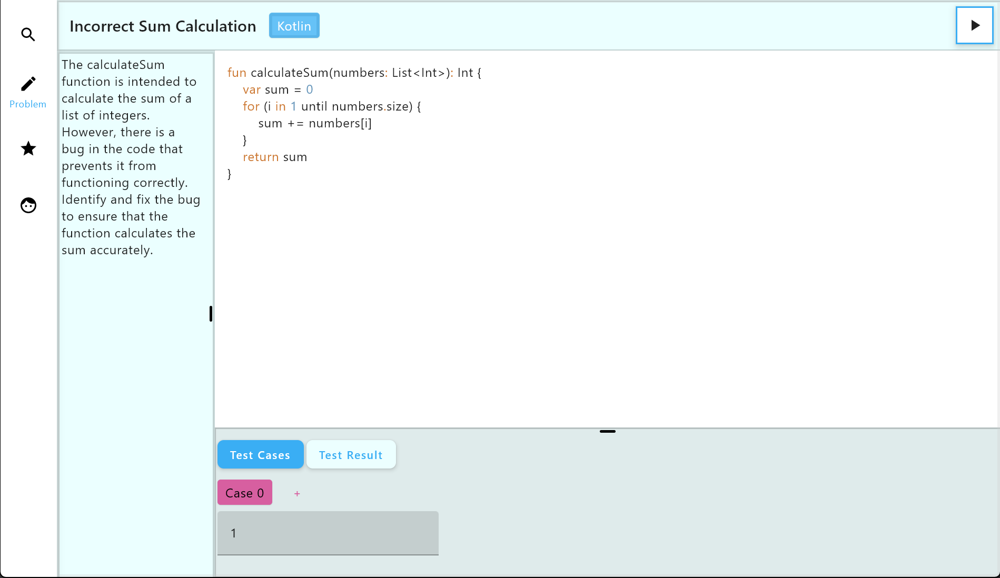

# Squash

## Members
Stefan Min (j28min@uwaterloo.ca)
Michael Huang (m98huang@uwaterloo.ca)
William Behnke (wbehnke@uwaterloo.ca)
Jason Li (j989li@uwaterloo.ca)

## Project Description
Squash is an app that helps developers practice their debugging skills, developed for a 
CS 346 project in Winter 2024. Although we are inspired by applications like Leetcode,
Squash differs from such apps through its focus on reviewing already completed code.

## Features

1. **Debugging Problems:**
    - Common/complex bugs to solve with a robust suite of test cases inspired by LeetCode.
    - The driving feature that led to LeetCode's success is their vast repository of coding problems that users can easily challenge, and we wanted to emulate that in our application.

2. **Multi-Language Support:**
    - Accommodates C, Python, Java, and other languages.
    - While interviewing programmers, we realized the importance of supporting a diverse set of languages. Everyone we talked with seemed to prefer a different language, and we want our application to allow users to feel comfortable coding in their favourite language.

3. **Personalized Accounts and User Process Tracking:**
    - Metrics like problems solved, time elapsed, and hints used for users to track their progress.
    - We understand the importance of providing users live data so they can visualize their progress. This helps to prevent users from feeling discouraged when they encounter a challenging problem.

4. **Difficulty Tiers and Problem Categorization:**
    - Easy, medium, hard challenges with tags for different bug types.
    - Initially, our project was geared toward green programmers, but after the interviews, we realized that more experienced programmers also need practice solving harder problems. Problems will be tagged by difficulty level and bug type to accommodate the range of experience among our user-base.

5. **Leaderboards:**
    - Ranks users based on problem-solving prowess using the collected metrics and scores.
    - Programmers are competitive by nature, and this was confirmed in our interviews. To fuel that competitive spirit, there will be a leaderboard for all users to aim for.

6. **Puzzle Rush Mode:**
    - Distills debugging into a fast-paced, gamified experience with multiple-choice questions. Leverages multiplayer capabilities for real-time competition akin to platforms like Kahoot, along with a matchmaking system to connect players.
    - The users we interviewed said that sometimes they do not have enough time to do
      Leetcode problems and that it would be nice to have a way to study on-the-go.
      Debugging is already inherently less code than implementing, but we thought that we
      could still become more mobile-friendly.

## Releases
- [SPRINT 1](https://git.uwaterloo.ca/m98huang/team-14/-/wikis/Release-Notes/02.16-(SPRINT-1))
- [SPRINT 2](https://git.uwaterloo.ca/m98huang/team-14/-/wikis/Release-Notes/03.08-(SPRINT-2))
- [SPRINT 3](https://git.uwaterloo.ca/m98huang/team-14/-/wikis/Release-Notes/03.22-(SPRINT-3))
- [SPRINT 4](https://git.uwaterloo.ca/m98huang/team-14/-/wikis/Release-Notes/04.05-(SPRINT-4))
